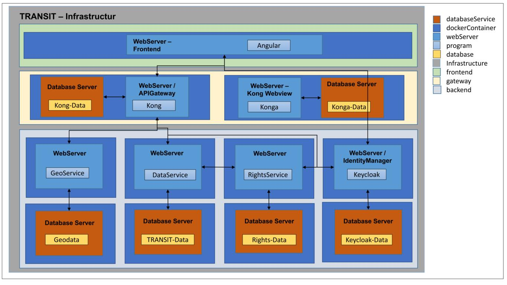

# TRANSIT-project
This repository provides the public access to the program code of the transit data trust platform for managing and sharing logistics order data.

The project is being carried out as part of the BMBF (Federal Ministry of Education and Research) funding campaign for data trust models with the funding number 16DTM109A-C.

Project Website: [https://transit-project.de/](https://transit-project.de/)

WebApp Website: [https://app.transit-project.de/](https://app.transit-project.de/)

Api Documentation: [https://documentation.transit-project.de/](https://documentation.transit-project.de/)

**It's a non-commercial project.**

## Documentation
The repository consists of several subfolders that represent the various subcomponents of the platform.
The following illustration shows the combination of the different sub-services.

### Parts

#### Frontend

Build in Angular. Uses Mapbox for Maps and Directionsservices.
Build with DevExpress for Tables and Charts.

#### Backend
Build in Java. Uses the Spring Framework and extensions to provide an api.
The HAETOS standard is used for the discovery of resources.
Uses a postgres database which performs the data storage.

#### Geoservice
Build in Java. Uses the Spring Framework and extensions to provide an api.
Uses the Postgis database, which can perform geometric calculations that are actively used. Is used to calculate delivery area polygons for a list of zip codes and/or federal states. The data basis includes all federal states and zip codes in Germany.

#### Keycloak
For this program only the configuration and templates have been adapted so that it can be executed in the given infrastructure environment. Keycloak is an open source program that is used for identity management.

#### Kong and Konga
The start scripts for the API gateway and other dependent containers have been adapted so that docker secret files can be used to transfer the passwords. Konga is a tool that allows you to manage the settings of the API gateway via a graphical interface.

#### RightsService
The rights service was first developed as part of the backend, but has now been outsourced to its own repository and is integrated as a submodule.
[Finer Grained Object-Specific Identity-Based Policy Machine](https://github.com/TRANSIT-Team/Finer-Grained-Attribute-Based-Policy-Machine)

***
## Open Source License

This project is licensed under the [MIT License](https://opensource.org/licenses/MIT).

## MIT License

Copyright (c) [2024] [TRANSIT Project]

Permission is hereby granted, free of charge, to any person obtaining a copy of this software and associated documentation files (the "Software"), to deal in the Software without restriction, including without limitation the rights to use, copy, modify, merge, publish, distribute, sublicense, and/or sell copies of the Software, and to permit persons to whom the Software is furnished to do so, subject to the following conditions:

The above copyright notice and this permission notice shall be included in all copies or substantial portions of the Software.