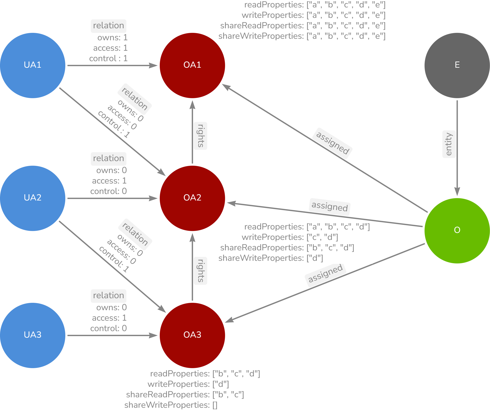

# Fine Grained Policy Machine

 The Service just stores and accomplishe the rights of the stored data. It does not generates ids.
 It needs a neo4J database. So its graph based.


## How it works
***More detailed informations are comming soon.***

### Abstract Layout
[](documentation/img/graph_standard_properties.png)


| Label | Description |
| ----------- | ----------- |
| UA | User Access |
| OA | Object Access |
| O | Object |
| E | Entity |

---
### Process

#### Creating an Identity
- Creating an identity by passing an id creates an UA Node with that id

#### Creating an Object

- For creating an object you need an identity id
- Creating  an object creates an O Node, which is linked to an E node (Entity) based on the given entityClass in the object
- If the E node not exists, it will be created and then linked
- Then an OA node will be created with stores the properties (read, write, share) which are given with the object
- Then the UA node (which is found by the given identity id) links to the OA node with `owns:1` relation


#### Relation Types


| Relation | Description | Allowed Actions |
| ----------- | ----------- | ----------- |
| owns | The creator | Can edit object |
| access | Defines the access to the object | Can edit nothing |
| control | Can change access for the child UA for the object | Can edit the access properties |


## API

{{base_url}}=`localhost:8085/api/v1`


### Identity

An Identity can be a groupId, userId, companyId etc. It must be an unique Id in the scenario. Don't mix up groupIds and userIds. 
If the having the same Ids the access will be giving to an entire group than just a single user. So use the service just with one type of
id (userId, companyId or groupId etc.).


#### Create an Identity
POST `{baseUrl}/identity`

RequestBody
```json
{
    "id": "11c408e0-1fcd-11ee-be56-0242ac120006"   
}
```

ResponseBody
```json
{
    "id": "11c408e0-1fcd-11ee-be56-0242ac120005",
    "name": "identity#11c408e0-1fcd-11ee-be56-0242ac120005"
}
```


#### Get an Identity
GET `{baseUrl}/identity/{id}`

ResponseBody
```json
{
    "id": "11c408e0-1fcd-11ee-be56-0242ac120005",
    "name": "identity#11c408e0-1fcd-11ee-be56-0242ac120005"
}
```

#### Delete
DELETE `{baseUrl}/identity/{id}`

## Object

Objects are entities like 'Car', 'Person', 'Order' or 'Device' etc. 


### Create an Object

POST `{baseUrl}/object`

Create O Node (an object or entity for example entity 'Car' with color, wheels, doors, fuel) for Identity #11c408e0-1fcd-11ee-be56-0242ac120005. 
Define what properties the entity has (or rather which should be defined in the access control).

RequestBody
```json
{
    "identityId": "11c408e0-1fcd-11ee-be56-0242ac120005",
    "objectId": "03389644-a202-449a-8906-69fab4dbd137",
    "objectEntityClass": "Car",
    "properties": [
        "color",
        "wheels",
        "doors",
        "fuel"
    ]
}
```

RequestBody
```json
{
    "objectId": "03389644-a202-449a-8906-69fab4dbd137",
    "objectEntityClass": "Car",
    "name": "Car#03389644-a202-449a-8906-69fab4dbd137"
}
```

### Update an Object

PUT `{baseUrl}/object/{id}`

Only the creator identity can update his object. 


RequestBody
```json
{
    "identityId": "11c408e0-1fcd-11ee-be56-0242ac120005",   
    "objectEntityClass": "Motorbike",
    "properties": [
        "color",
        "wheels",     
        "fuel"
    ]
}
```

ResponseBody
```json
{
    "objectId": "03389644-a202-449a-8906-69fab4dbd137",
    "objectEntityClass": "Motorbike",
    "name": "Motorbike#03389644-a202-449a-8906-69fab4dbd137"
}
```
---

**IMPORTANT**: If the properties changed, the access is also changed recursiv! So for the owner the identityProperties will be set to the follwing example. If there a new properties, the will be just added to your access (non-recursiv). If properties are deleted, the will be deleted from you access and also recursiv.

For now there is no renaming function for properties.

```json
{
    "identityProperties":
      {
        "readProperties": ["color, wheels, fuel"],
        "writeProperties":  ["color, doors, fuel"],
        "shareReadProperties": ["color, wheels, fuel"],
        "shareWriteProperties":  ["color, wheels, fuel"]
      }
}
```

### Delete an Object

DELETE `{baseUrl}/object/{id}?requestedById={byId}`

Only the creator-identity (`{byId}`) can delete his object. It deletes the object and the accesses for all identities.
So if the object is deleted, the access is also deleted recursiv!


## Access Management

### Validation rules

1. You can't give more properties (read, write, share) than you have
2. WriteProperties can just be the readProperties or less
3. ShareReadProperties can just be readProperties or less
4. ShareWriteProperties can just be writeProperties or less

**IMPORTANT**: When you decrease the properties (of your own or an other identity) the will decrease recursiv for all child identitys which have access to this object over the identity you are updating.

### Create access on an object for an identity

PUT `{baseUrl}/access/{id}?identityId={forId}&requestedById={byId}`

Create Access for an object by {id} for an identity `{forId}` by the requesting identity `{byId}`.
For example I will give you access to my object. Then the identityId is your Id and the requestedById is myId.


RequestBody
```json
{
    "identityProperties":
      {
        "readProperties": ["color, wheels, fuel"],
        "writeProperties":  ["color, doors, fuel"],
        "shareReadProperties":  ["color"],
        "shareWriteProperties":  ["color"]
      }
}
```

ResponseBody
```json
{
    "objectId": "03389644-a202-449a-8906-69fab4dbd137",
    "objectEntityClass": "Motorbike",
    "identityId": "11c408e0-1fcd-11ee-be56-0242ac120006",
    "identityProperties":
      {
        "readProperties": ["color, wheels, fuel"],
        "writeProperties":  ["color, doors, fuel"],
        "shareReadProperties":  ["color"],
        "shareWriteProperties":  ["color"]
      }
}
```


### Update access on an object for an identity

PUT `{baseUrl}/access/{id}?identityId={forId}&requestedById={byId}`

Update Access for an object by {id} for an identity `{forId}` by the requesting identity `{byId}`.
Be aware of the validation effects.

**IMPORTANT**: You can only give rights that are equal or less than you rights. So you can't give more rights than you have. That also means if you want to update your rights than you can't give you more rights than you currently have, even if you are the owner of the object. If you are the owner and want to set new properties to your identity than you have to update the object properties via the object endpoint `/object/{id}`.

RequestBody
```json
{
    "identityProperties":
      {
        "readProperties": ["color, wheels, fuel"],
        "writeProperties":  ["color, doors, fuel"],
        "shareReadProperties":  ["color"],
        "shareWriteProperties":  ["color, fuel"]
      }
}
```

ResponseBody
```json
{
    "objectId": "03389644-a202-449a-8906-69fab4dbd137",
    "objectEntityClass": "Motorbike",
    "identityId": "11c408e0-1fcd-11ee-be56-0242ac120006",
    "identityProperties":
      {
        "readProperties": ["color, wheels, fuel"],
        "writeProperties":  ["color, doors, fuel"],
        "shareReadProperties":  ["color"],
        "shareWriteProperties":  ["color, fuel"]
      }
}
```
---

**IMPORTANT**: You can send the Requestbody also like this exmaple. But because this is a PUT Request the `shareReadProperties` and `shareWriteProperties` will be set to an empty list `[]` (also recursiv!).

RequestBody
```json
{
    "identityProperties":
      {
        "readProperties": ["color, wheels, fuel"],
        "writeProperties":  ["color, doors, fuel"]     
      }
}
```

### Delete access on an object for an identity

DELETE `{baseUrl}/access/{id}?identityId={forId}&requestedById={byId}`

Delete access for an object for an identity `{forId}` by a identity `{byId}`.

**IMPORTANT**: This deletes recursive all access given through the identity `{forId}`.

