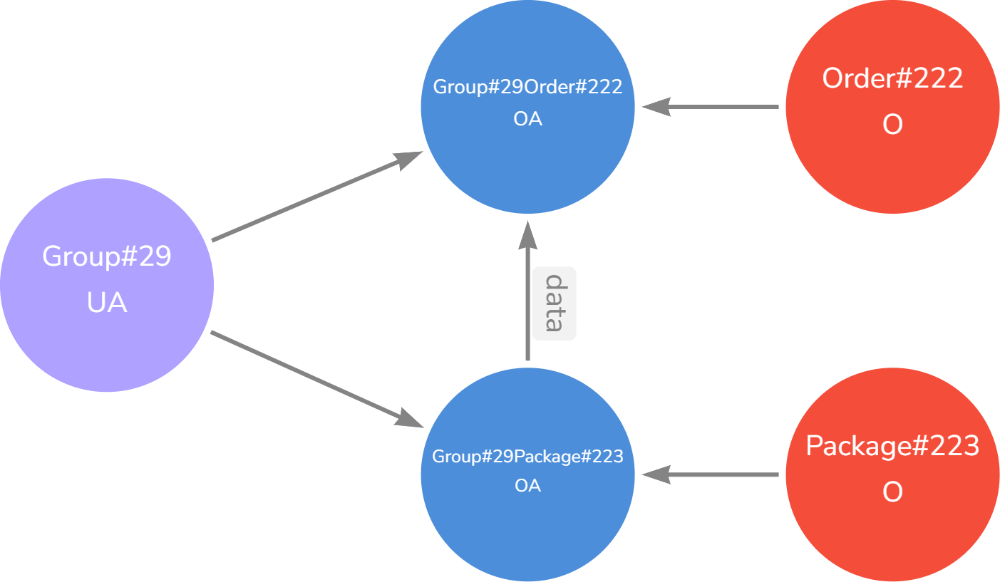
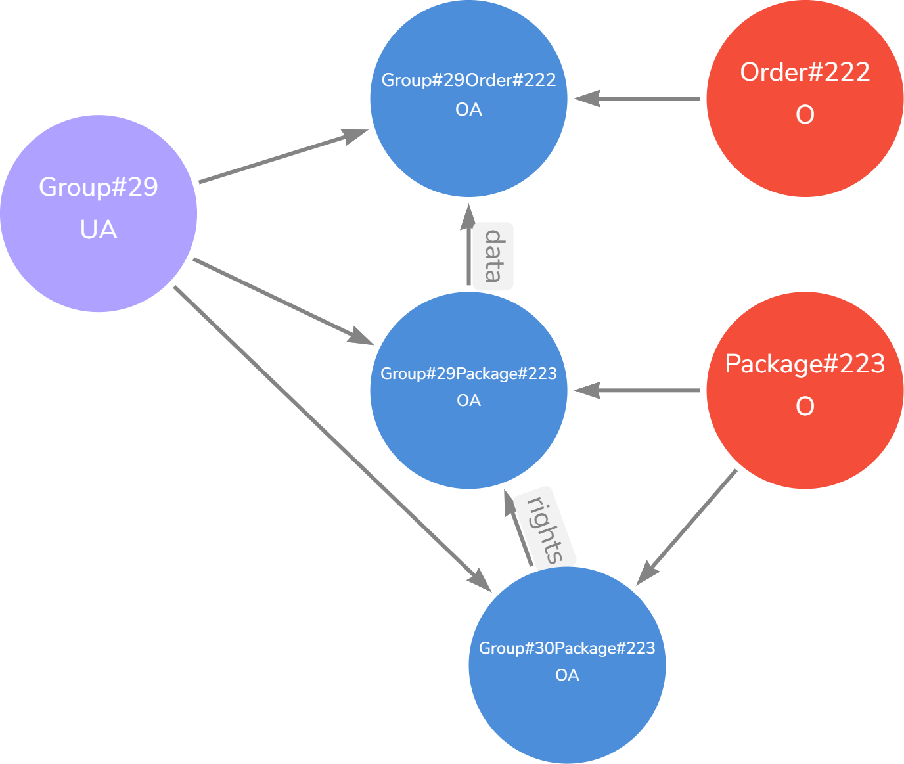
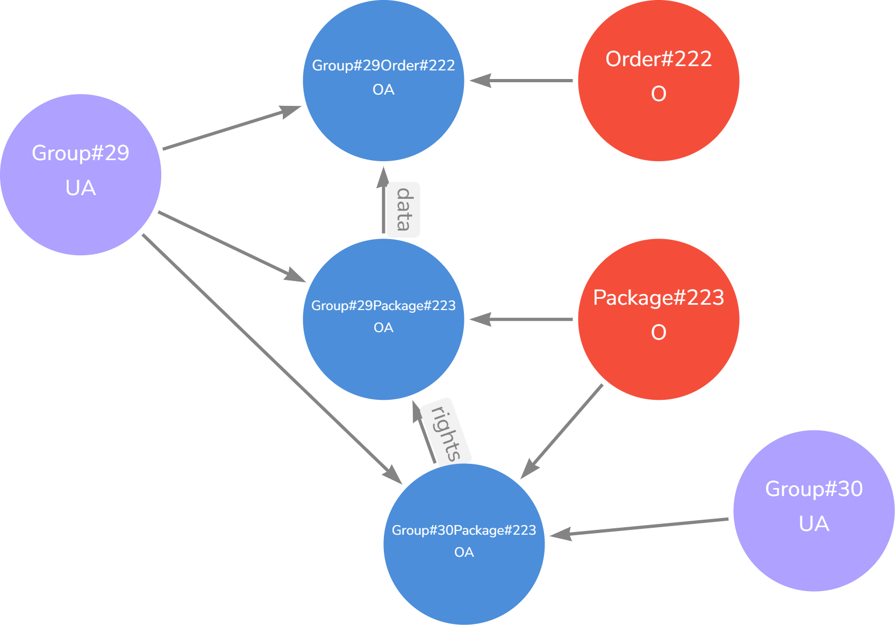

<link href="css/style.css" rel="stylesheet"></link>

# **Access Management with Graphs**


## **Basics**
### Base model

Example:
Group=Company

We want to store the privileges for Group 29 of the Order 222 (entity). In that case we store the order as a object-node with the id. This node will be connected to an "object-attribute"-node (OA-node) which stores the read and write privileges. The group node is also connected to the OA-node.

Order-Example (backend stored):
```json
{
"id":"222",
"deliveryDate":"05.07.23",
"pickupDate":"04.07.23",
"state":"open"
}
```

**Simple Example:**


<br><br>


**Detailed:**


<br><br>

### Child Entity Nodes
An order has packages. If you only have the orderId and want to go down the childs to see whats the rights for a group of all nodes associated to the parent order node, this is how it's set up.


<br><br>


### Sharing Node Priviliges

There are two options for giving rights for a node. 

Group#29 wants to give Group#30 access to their package#223. For that a new OA-Node for Group#30 and Package#223 needs to be created. The new node (aka sub-node) is then a child node of the origin OA-Node from Group#29. This is needed if Group#29 wants to delete the rights of Group#30 for Package#223 to check which is parent OA-Node and who has for it.



In this case a new Node for the Group#30 needs/is also created.




### Policy Class (PC)
PC-Node exists once.
Needed that the algorithm nows that he reached the last node and can go back.


<br><br>

---

## **Arrows**

### Assignments
#### OA Assignment
Declares that for a O-Node is a OA-Node which stores the privileges of a group for this node.


<br><br>

#### PC Assignment
All OA-Nodes points with an assignemt on PC-Node. Needed for the algorithm.


<br><br>

### Data Connection
Data-Arrow of OA-Nodes specifies which connected O-Node is a child another connected O-Node. Both OA-Nodes are connected to a single group.


<br><br>

**Example:**


<br><br>

### Rights Connection

See shared rights. Sub-Rights for a O-Node


<br><br>

**Example:**


<br><br>

### Association

Shows which group has rights on OA-Node and O-Node. Operations a declared in association-arrow like read and write for an O-Node (ex. Order). The arrow-operations also for first fast searching.


<br><br>
The specific fields which the group can read
and write a declared in the OA-Node itself. 


<br><br>

### Summary

To wrap all things up in our graph example:


<br><br>

---

## **Searching for Modes**

#### Searching for the privileges
Parameters we with the search-request:

- groupdId
- entityId (in that case orderId)

Steps:
1. Left-Search: searching for group (Group#29)
2. get all OA-Nodes for group
3. Right: Search for the entity-node (order#222)
4. Finding connected OA-Node
5. read out privileges
 <br/><br/>


#### Searching for the privileges and child privileges
Parameters we with the search-request:

- groupdId
- entityId (in that case orderId)

Steps:
1.-5. Step like previous sections

1.  Check if the OA-Node has a data-arrow pointing on it. if yes going to child OA-Node and on these node connected O-Nodes and step 2
2. reading out O-Node id and OA-Node stored privilages
3. doing step 1 again until there is no child OA-Node
<br/><br/>


### Deep Search

### Width Search